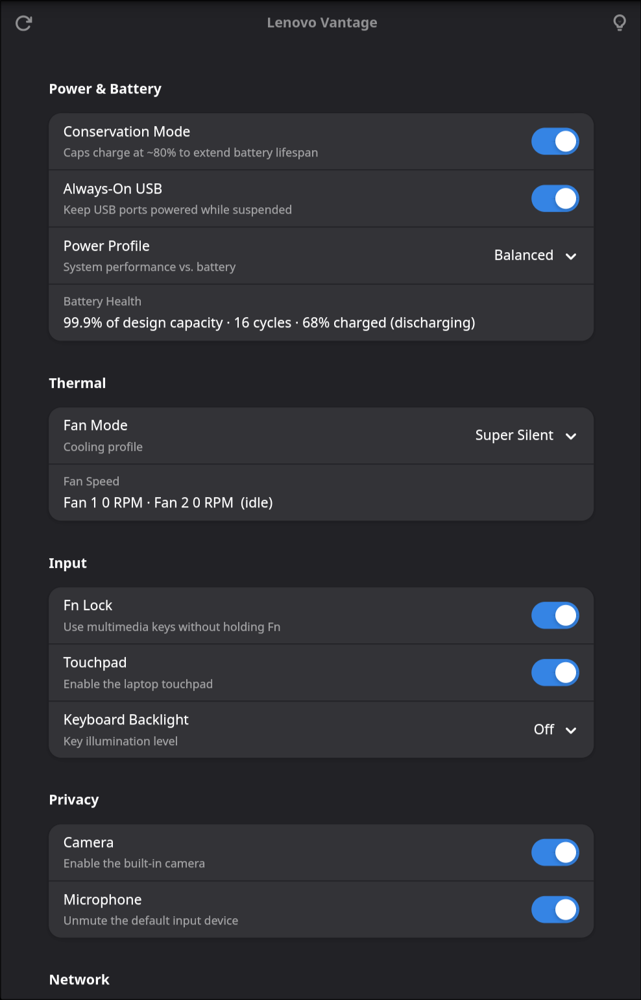

# Lenovo Vantage for Linux

A native GTK4 app that brings Lenovo Vantage controls to Linux — battery conservation, fan modes, thermal profiles, keyboard backlight, and more. Works across IdeaPad, Yoga, and Legion models.



## Features

**Power & Battery**
- Conservation Mode — cap charge at ~80% to extend battery lifespan
- Always-On USB — keep USB ports powered while suspended
- Power Profile — Low Power / Balanced / Performance (via `power-profiles-daemon`)
- Battery Health — shows capacity vs. design capacity, charge cycles, and current charge

**Thermal**
- Fan Mode — Super Silent, Standard, Dust Cleaning, Efficient Thermal Dissipation
- Live fan RPM readout for both fans

**Graphics** (NVIDIA Optimus laptops)
- Graphics Mode — lock the machine to the integrated GPU (*Integrated*, blacklists
  the NVIDIA modules and powers the dGPU off via udev), or restore *Hybrid* so apps
  can render on the dGPU on demand. Wayland-only.

  > **Reboot required.** Switching modes rewrites a modprobe blacklist + udev rule
  > and rebuilds the initramfs, so the change only takes effect after a reboot. To
  > go back, pick the other mode in the app and reboot again — *Hybrid* removes the
  > files vantage added and restores the distro default. The initramfs rebuild is
  > distro-agnostic (works with `update-initramfs`, `mkinitcpio`/`limine-mkinitcpio`,
  > `dracut`, and `booster`); in *Integrated* mode CUDA/NVENC/PRIME offload are
  > unavailable until you switch back.

**Input**
- Fn Lock — use multimedia keys without holding Fn
- Keyboard Backlight — set illumination level
- Touchpad toggle — Wayland-native via kernel `inhibited` attribute

**Privacy & Network**
- Microphone mute via `pactl`
- Wi-Fi toggle via `nmcli`

**About**
- Device info panel — model, CPU, RAM, OS, serial number

Controls auto-hide when the underlying hardware isn't present, so the same app works across different Lenovo models. The Graphics Mode control appears only when an NVIDIA dGPU is detected. Legion-only controls (Super key lock, fast charge, display overdrive) appear automatically when the `LenovoLegionLinux` kernel module is loaded.

> **Note:** Camera privacy is not controlled in software. On many models (e.g. Yoga Pro 7i Gen 11) the `camera_power` sysfs bit is cosmetic and doesn't actually gate the sensor — use the laptop's physical camera key instead, which is EC-backed.

## Installation

Vantage uses the [Meson](https://mesonbuild.com/) build system, the standard
for GTK/GNOME applications.

```bash
git clone https://github.com/isshin1/vantage.git
cd vantage
./install.sh                 # install runtime + build dependencies
meson setup build
sudo meson install -C build
```

Then launch **Lenovo Vantage** from your applications menu, or run `vantage` from the terminal.

### Command-line options

```
vantage [-h] [-t] [-d] [-v]

  -h, --help     show this help message and exit
  -t, --tray     start minimised to the system tray (no window)
  -d, --debug    enable verbose debug logging to stderr
  -v, --version  show the version and exit
```

Run with no options to open the settings window.

### Manual dependency install

`./install.sh` handles dependencies automatically. If you prefer to install them yourself, you need the runtime libraries plus the build tools (`meson`, `ninja`, `gettext`, and the GLib schema/AppStream utilities):

**Arch Linux**
```bash
sudo pacman -S python-gobject gtk4 libadwaita polkit networkmanager \
               meson ninja gettext glib2 appstream
```

**Debian / Ubuntu / Mint / Pop!_OS**
```bash
sudo apt install python3-gi gir1.2-gtk-4.0 gir1.2-adw-1 libadwaita-1-0 policykit-1 \
                 meson ninja-build gettext libglib2.0-bin appstream
```

**Fedora**
```bash
sudo dnf install python3-gobject gtk4 libadwaita polkit NetworkManager pipewire-pulseaudio \
                 meson ninja-build gettext glib2-devel appstream
```

**openSUSE Tumbleweed**
```bash
sudo zypper install python3-gobject gtk4 libadwaita typelib-1_0-Gtk-4_0 typelib-1_0-Adw-1 \
                    polkit NetworkManager pipewire-pulseaudio meson ninja gettext-tools \
                    glib2-tools appstream
```

## Uninstall

```bash
sudo ninja -C build uninstall
```

## Architecture

Vantage ships two executables backed by a shared Python package:

- **`vantage`** — GTK4 + libadwaita settings window with grouped switch/combo rows for every control. The system-tray icon is built in (no separate process or daemon).
- **`vantage-helper`** — a minimal root helper that performs privileged sysfs writes. Invoked via `pkexec`, gated by polkit (`auth_admin_keep`) — you authenticate once per session, not per change. No long-running daemon.

State is read directly from sysfs (no root needed for reads). Unprivileged operations (microphone, Wi-Fi, power profile) run with no prompt. The *Run in Background* preference is persisted with GSettings.

### Project layout

```
vantage/
├── meson.build              # top-level build definition
├── data/                    # desktop entry, AppStream metainfo, GSettings
│   ├── org.vantage.Vantage.desktop.in
│   ├── org.vantage.Vantage.metainfo.xml.in
│   ├── org.vantage.Vantage.gschema.xml
│   ├── org.vantage.helper.policy.in
│   └── icons/               # hicolor app + symbolic icons
├── src/
│   ├── vantage.in           # launcher → /usr/bin/vantage
│   ├── vantage-helper.in    # privileged launcher → /usr/bin/vantage-helper
│   └── vantage/             # importable Python package
│       ├── main.py          # entry point + GApplication
│       ├── window.py        # GTK4 settings window
│       ├── client.py        # backend facade + GSettings config
│       ├── hardware.py      # low-level sysfs access
│       ├── tray.py          # SNI tray + dbusmenu
│       └── helper.py        # whitelisted privileged writes
└── po/                      # gettext translation catalogs
```

The app ID is `org.vantage.Vantage`; the *Run in Background* preference is stored
in GSettings under that schema.

### Running from source

Because the preference lives in GSettings, an uninstalled run needs the schema
compiled and on the schema path:

```bash
glib-compile-schemas data
GSETTINGS_SCHEMA_DIR=$PWD/data PYTHONPATH=$PWD/src python3 -m vantage.main
```

**System tray:** enable *Run in Background* in the app settings. When active, closing the window hides it to a tray icon; left-click toggles the window; right-click shows a full quick-toggle menu. The tray is implemented via the `org.kde.StatusNotifierItem` D-Bus protocol and works on KDE, Hyprland + Waybar, Sway, and any compositor with SNI support. Run `vantage --tray` to start directly in the background without showing the window.

## Requirements

**Runtime**
- Python 3 + `python-gobject`
- GTK4 + libadwaita
- `polkit` / `pkexec`
- `networkmanager`
- `pulseaudio` or `pipewire-pulse`
- `power-profiles-daemon` *(optional — required for Power Profile control)*
- a StatusNotifierItem host *(optional — required for the system tray; e.g. KDE, Waybar)*

**Build**
- `meson` + `ninja`
- `gettext`
- `glib2` schema tools (`glib-compile-schemas`)
- `appstream` *(optional — used to validate the metainfo)*
